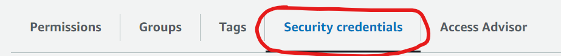
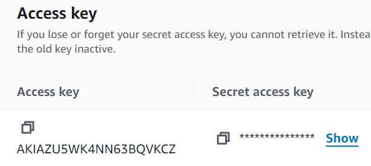
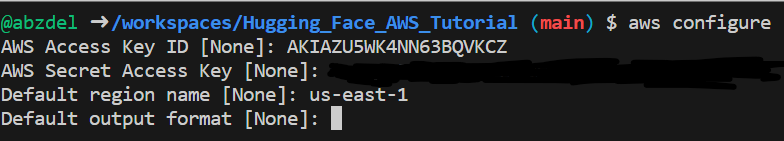
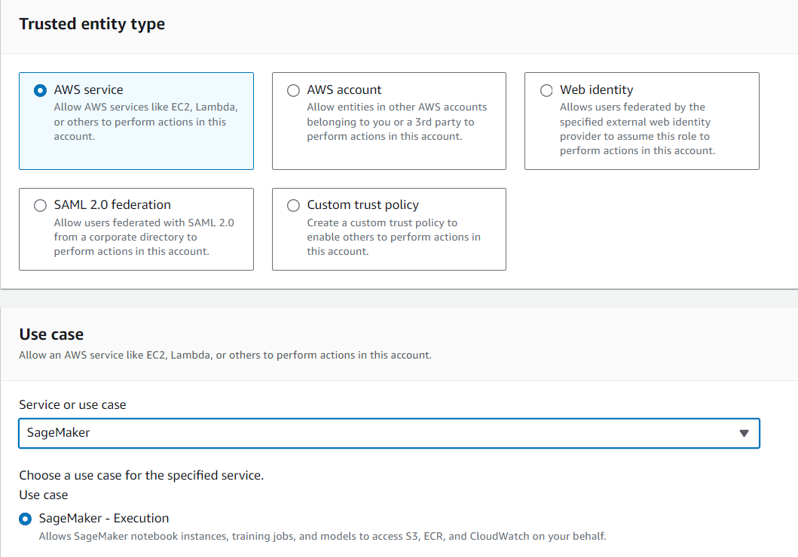
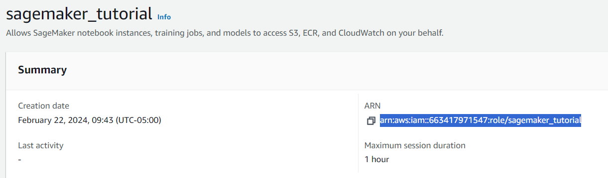
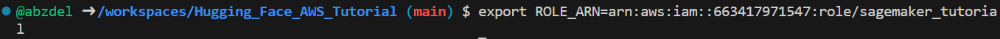

# Hosting Hugging Face Models on Amazon SageMaker

Welcome to the comprehensive guide on hosting your own stable inference environment for Hugging Face models using Amazon SageMaker! Whether you're a seasoned developer or just getting started, this tutorial will walk you through the steps to effortlessly deploy and serve your models with confidence. By the end, you'll have a robust setup on AWS SageMaker, empowering you to seamlessly deploy your models for real-world applications.

For our application, we'll be hosting [our own instance of Stable Diffusion 2 for text-to-image generation!](https://huggingface.co/stabilityai/stable-diffusion-2)

## Why Amazon SageMaker? Why Hugging Face?

SageMaker offers managed solutions for the entire machine learning lifecycle. It provides a hassle-free environment to deploy, manage, and scale your models. If you're looking for ways to get your models into production without needing to worry too much about the underlying complexities of model hosting, SageMaker is your tool.

As for Hugging Face - you and I don't have millions of dollars to throw at training advanced neural networks (at least not yet :wink:) with billions of parameters. Luckily for us, Hugging Face has changed the game and allowed users to host their own custom models that we can download, fine-tune, and host either in-house in Hugging Face Spaces or seamlessly transfer over to AWS. Hugging Face allows mass availability of open-source models designed with the most cutting-edge methods. I believe expertise around using pre-trained models will grow in demand for MLOps practitioners in the near future, as it's simply too efficient and cost-effective to ignore.

## What you'll Learn
- Setting up an Amazon SageMaker instance
- Preparing your Hugging Face model for deployment
- Deploying your model on SageMaker with ease
- Accessing your deployed model


## Prerequisites
Before getting started, ensure you have:
- An AWS Account
- [A trained Hugging Face model you'd like to host](https://huggingface.co/models)
- Basic knowledge of AWS services (specifically Lambda + SageMaker) will be helpful but not required


## Step 1: Authenticate your Environment
- for this, we need an IAM User and IAM role
- skip to step 2 if you already have this set up

### 1.1 Setup IAM User

To authenticate for a command line tool like this one, we need to access AWS through access key credentials.
Head over to your AWS console and go to IAM Users. Click on the yellow "Create User" button on the top right:


Make sure you check the box that says "Provide Access to the Management Console". For our purposes, we'll tick the second box to create an IAM User.


To keep things simple, we won't require a new password for the new user's first sign-in.


As for permissions, let's attach policies directly and look for "AmazonSageMakerFullAccess":


Navigate through the remainder of user creation. Once AWS takes you back to your list of all IAM Users, select the IAM User you just created. Navigate to the security credentials tab:


Scroll down a bit to create access keys. When prompted for a use case, select command line interface (should be the first option).


Now, we have an access key and a secret key.


We can now authenticate our environment using these keys. Type in ```aws configure```, copy and paste your access keys, and select your desired region (we will use us-east-1).



<br><br>
### 1.2 Setup IAM Role

Head over to your AWS console and go to IAM Roles. Click on the yellow "Create Role" button on the top right:


Select AWS service, and SageMaker when prompted. It should automatically attach the SageMaker Full Access policy. Name your role, and continue with the default settings.


Select the role you just made and copy your ARN. Export this to an environment variable



## Step 2: Hosting your model

Choose the Hugging Face model you'd like to be hosted. For this project, we'll host our own version of [stable diffusion](https://huggingface.co/stabilityai/stable-diffusion-2)
